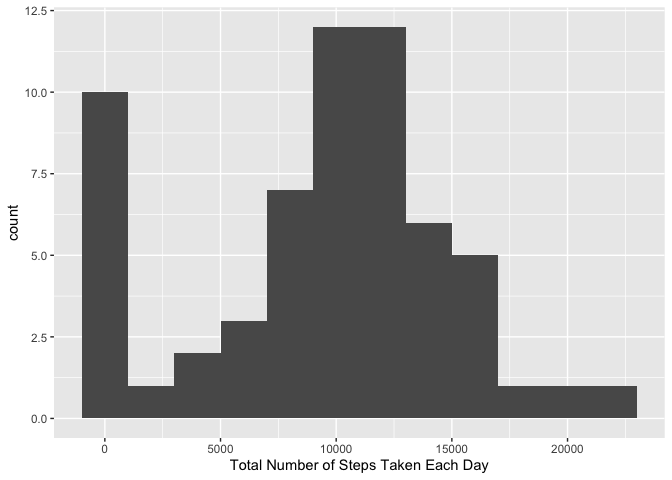
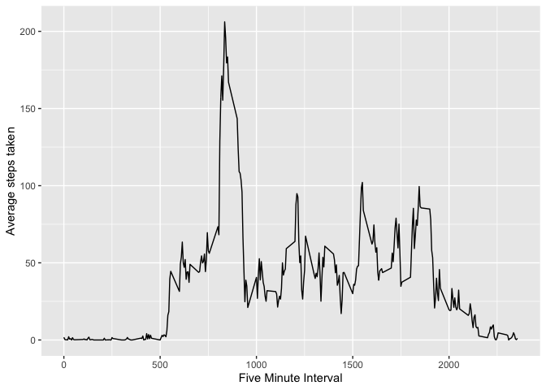
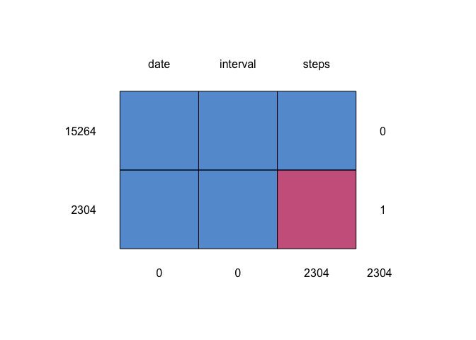
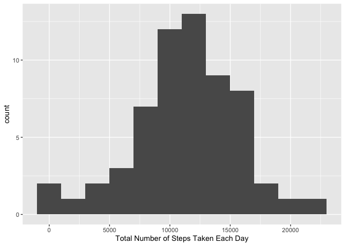
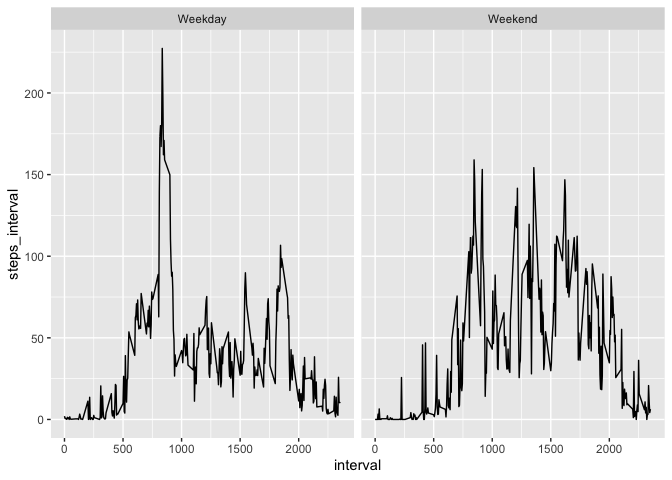

## Loading and preprocessing the data


```r
library(tidyverse) #loading tidyverse library
```

```
## Warning: package 'ggplot2' was built under R version 4.0.2
```

```
## Warning: package 'tibble' was built under R version 4.0.2
```

```r
data <- read_csv("activity.zip") # I used read_csv instead of read.csv
```


```r
str(data)
```

```
## tibble [17,568 × 3] (S3: spec_tbl_df/tbl_df/tbl/data.frame)
##  $ steps   : num [1:17568] NA NA NA NA NA NA NA NA NA NA ...
##  $ date    : Date[1:17568], format: "2012-10-01" "2012-10-01" ...
##  $ interval: num [1:17568] 0 5 10 15 20 25 30 35 40 45 ...
##  - attr(*, "spec")=
##   .. cols(
##   ..   steps = col_double(),
##   ..   date = col_date(format = ""),
##   ..   interval = col_double()
##   .. )
```


## What is mean total number of steps taken per day?


```r
data_sum <- data %>%
        group_by(date) %>%
        summarise(steps_per_day = sum(steps, na.rm = T)) %>%  
        summarise(ava_steps = mean(steps_per_day, na.rm = T), median_steps = median(steps_per_day, na.rm = T))  # mean  and median total number of steps taken per day
```

```
## `summarise()` ungrouping output (override with `.groups` argument)
```
1. Make a histogram of the total number of steps taken each day


```r
daily_data <- data %>%
        group_by(date) %>%
        summarise(steps_per_day = sum(steps, na.rm = T))
```

```
## `summarise()` ungrouping output (override with `.groups` argument)
```

```r
ggplot(daily_data, aes(x=steps_per_day)) +
        geom_histogram(binwidth = 2000) +
        labs(x = "Total Number of Steps Taken Each Day")
```

<!-- -->


## What is the average daily activity pattern?

1. Make a time series plot (i.e. `type = "l"`) of the 5-minute interval (x-axis) and the average number of steps taken, averaged across all days (y-axis)


```r
interval_data <- data %>%
        group_by(interval) %>%
        summarise(interval_steps = mean(steps, na.rm = T))
```

```
## `summarise()` ungrouping output (override with `.groups` argument)
```

```r
ggplot(interval_data, aes(x=interval, y = interval_steps)) +
        geom_line() +
        labs(x = "Five Minute Interval",
             y = "Average steps taken")
```

<!-- -->


2. Which 5-minute interval, on average across all the days in the dataset, contains the maximum number of steps?


```r
range(data$steps, na.rm = T) # finding the maximum number of steps within each 5-min interval
```

```
## [1]   0 806
```

```r
data %>%
        filter(steps == 806) #interval 615
```

```
## # A tibble: 1 x 3
##   steps date       interval
##   <dbl> <date>        <dbl>
## 1   806 2012-11-27      615
```

Answer: Interval 615 contains the maximum number of steps on average accross all days in the dataset.

## Imputing missing values

1. Calculate and report the total number of missing values in the dataset (i.e. the total number of rows with `NA`s)


```r
summary(data)
```

```
##      steps             date               interval     
##  Min.   :  0.00   Min.   :2012-10-01   Min.   :   0.0  
##  1st Qu.:  0.00   1st Qu.:2012-10-16   1st Qu.: 588.8  
##  Median :  0.00   Median :2012-10-31   Median :1177.5  
##  Mean   : 37.38   Mean   :2012-10-31   Mean   :1177.5  
##  3rd Qu.: 12.00   3rd Qu.:2012-11-15   3rd Qu.:1766.2  
##  Max.   :806.00   Max.   :2012-11-30   Max.   :2355.0  
##  NA's   :2304
```


```r
# This command gives the sum of missing values in the whole data frame column wise :
colSums(is.na(data))
```

```
##    steps     date interval 
##     2304        0        0
```


2. Devise a strategy for filling in all of the missing values in the dataset. The strategy does not need to be sophisticated. For example, you could use the mean/median for that day, or the mean for that 5-minute interval, etc.

We are going to try to learn a new package here: *mice*. This package helps us to look at missing data patterns as well as imputing the missing data.


```r
library(mice)
```

```
## Warning: package 'mice' was built under R version 4.0.2
```

```
## 
## Attaching package: 'mice'
```

```
## The following objects are masked from 'package:base':
## 
##     cbind, rbind
```

```r
md.pattern(data)
```

<!-- -->

```
##       date interval steps     
## 15264    1        1     1    0
## 2304     1        1     0    1
##          0        0  2304 2304
```

The output tells us that 15264 samples are complete. 2304 samples miss only the steps measurement. The information is same as what we have found previously. 

### imputing the missing data with mice using the Perdictive mean matching method (pmm)


```r
tempData <- mice(data, m = 5, maxit = 50, method = "pmm", seed = 500)
summary(tempData)
```

Let's take a look at the imputed data.


```r
tempData$imp$steps
```


3. Create a new dataset that is equal to the original dataset but with the missing data filled in.


```r
imputed_data <- complete(tempData,1)
str(imputed_data) # make sure the new dataset shares the same structure
```

4. Make a histogram of the total number of steps taken each day and Calculate and report the **mean** and **median** total number of steps taken per day. Do these values differ from the estimates from the first part of the assignment? What is the impact of imputing missing data on the estimates of the total daily number of steps?


```r
imputed_daily <- imputed_data %>%
        group_by(date) %>%
        summarise(steps_per_day = sum(steps, na.rm = T)) %>%  
        summarise(ava_steps_imp = mean(steps_per_day, na.rm = T), median_steps_imp = median(steps_per_day, na.rm = T)) 
```

```
## `summarise()` ungrouping output (override with `.groups` argument)
```

```r
imputed_daily$ava_steps_imp  # mean total number of steps taken per day
```

```
## [1] 11316.41
```

```r
imputed_daily$median_steps_imp  # median total number of steps taken per day
```

```
## [1] 11458
```

Both mean and median total number of steps taken per day increased with imputing missing data. 

Mean increased from 9354.2295082 to 1.131641\times 10^{4} and the median increased from 1.0395\times 10^{4} to 1.1458\times 10^{4}.

Here is the histogram with imputed data.


```r
imputed_daily <- imputed_data %>%
        group_by(date) %>%
        summarise(steps_per_day = sum(steps, na.rm = T)) 
```

```
## `summarise()` ungrouping output (override with `.groups` argument)
```

```r
ggplot(imputed_daily, aes(x=steps_per_day)) +
        geom_histogram(binwidth = 2000) +
        labs(x = "Total Number of Steps Taken Each Day")
```

<!-- -->

We see the number of steps taken each day do not take as many as zero values as before. 

## Are there differences in activity patterns between weekdays and weekends?

We first need to process the date.


```r
library(lubridate)
```

```
## 
## Attaching package: 'lubridate'
```

```
## The following objects are masked from 'package:base':
## 
##     date, intersect, setdiff, union
```

1. Create a new factor variable in the dataset with two levels -- "weekday" and "weekend" indicating whether a given date is a weekday or weekend day.


```r
day_of_week <- imputed_data %>%
        mutate(date = ymd(date), weekday_or_weekend = case_when(wday(date) %in% 2:6 ~ "Weekday",
                                                                wday(date) %in% c(1,7) ~ "Weekend" )) %>%
      select( - date) %>%
        group_by(interval, weekday_or_weekend) %>%
        summarise(steps_interval = mean(steps))
```

```
## `summarise()` regrouping output by 'interval' (override with `.groups` argument)
```


1. Make a panel plot containing a time series plot (i.e. `type = "l"`) of the 5-minute interval (x-axis) and the average number of steps taken, averaged across all weekday days or weekend days (y-axis). The plot should look something like the following, which was created using **simulated data**:


```r
head(day_of_week)
```

```
## # A tibble: 6 x 3
## # Groups:   interval [3]
##   interval weekday_or_weekend steps_interval
##      <dbl> <chr>                       <dbl>
## 1        0 Weekday                     2.02 
## 2        0 Weekend                     0    
## 3        5 Weekday                     0.667
## 4        5 Weekend                     0    
## 5       10 Weekday                     0.689
## 6       10 Weekend                     0
```


```r
ggplot(day_of_week, aes(x=interval, y = steps_interval)) +
        geom_line() +
        facet_wrap(~ weekday_or_weekend)
```

<!-- -->

